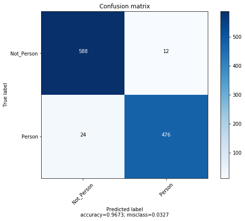
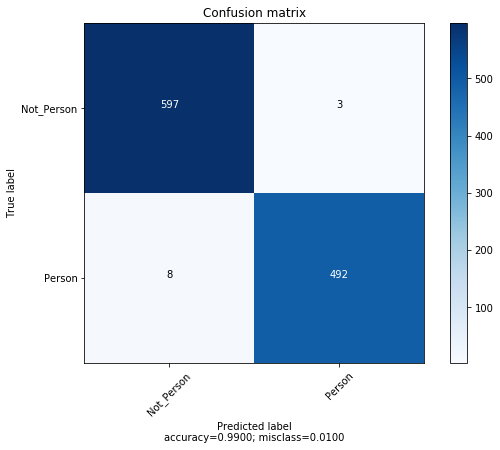
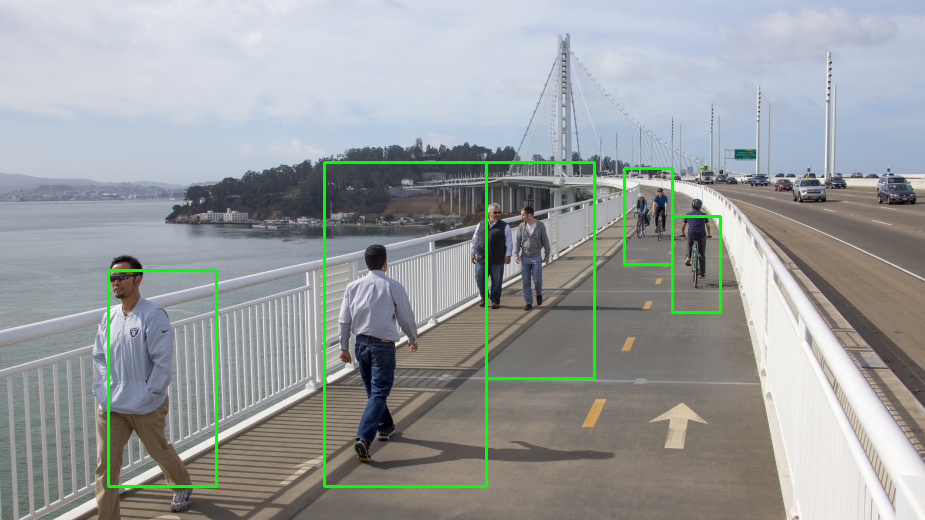
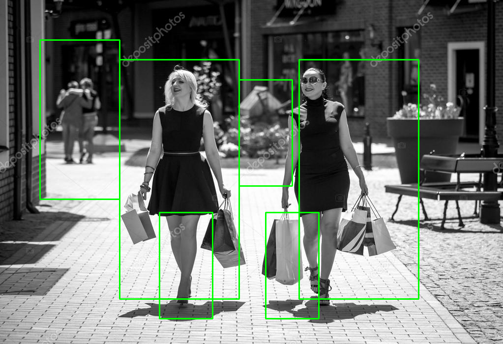
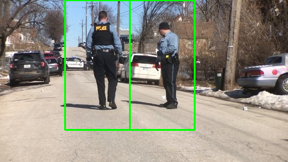

# Extracción de rasgos en imágenes

El documento que a continuación se presenta se corresponde con la primera práctica de la asignatura Extracción de Características en Imágenes, del máster universitario en Ciencia de Datos e Ingeniería de Computadores. El objetivo de esta práctica de evaluación es extraer diferentes tipos de rasgos de una imagen y usarlos para aprender conceptos sencillos mediante el uso de clasificadores.

- [Extracción de rasgos en imágenes](#extracci-n-de-rasgos-en-im-genes)
  * [Contenido de la práctica](#contenido-de-la-pr-ctica)
  * [Conjunto de datos](#conjunto-de-datos)
- [Parte obligatoria](#parte-obligatoria)
  * [Evaluación clasificación HoG+SVM: medidas de bondad y parámetros](#evaluaci-n-clasificaci-n-hog-svm--medidas-de-bondad-y-par-metros)
    + [HOG + SVM: Medidas de bondad del clasificador generado](#hog---svm--medidas-de-bondad-del-clasificador-generado)
    + [HOG + SVM: Validación cruzada](#hog---svm--validaci-n-cruzada)
    + [HOG + SVM: Optimización de parámetros](#hog---svm--optimizaci-n-de-par-metros)
  * [Evaluación clasificación LBP+SVM: medidas de bondad y parámetros](#evaluaci-n-clasificaci-n-lbp-svm--medidas-de-bondad-y-par-metros)
    + [Implementación descriptor LBP:](#implementaci-n-descriptor-lbp-)
    + [LBP + SVM: Medidas de bondad del clasificador generado](#lbp---svm--medidas-de-bondad-del-clasificador-generado)
    + [LBP + SVM: Validación cruzada](#lbp---svm--validaci-n-cruzada)
    + [LBP + SVM: Optimización de parámetros](#lbp---svm--optimizaci-n-de-par-metros)
- [Mejoras voluntarias](#mejoras-voluntarias)
  * [LBP-uniforme](#lbp-uniforme)
    + [Implementación descriptor LBP-uniforme:](#implementaci-n-descriptor-lbp-uniforme-)
    + [LBP-Uniforme + SVM: Medidas de bondad del clasificador generado](#lbp-uniforme---svm--medidas-de-bondad-del-clasificador-generado)
    + [LBP-Uniforme + SVM: Validación cruzada](#lbp-uniforme---svm--validaci-n-cruzada)
    + [LBP-Uniforme + SVM: Optimización de parámetros](#lbp-uniforme---svm--optimizaci-n-de-par-metros)
  * [Combinación de características](#combinaci-n-de-caracter-sticas)
    + [HOG + LBP + SVM: Medidas de bondad del clasificador generado](#hog---lbp---svm--medidas-de-bondad-del-clasificador-generado)
    + [HOG + LBP + SVM: Validación cruzada](#hog---lbp---svm--validaci-n-cruzada)
    + [HOG + LBP + SVM: Optimización de parámetros](#hog---lbp---svm--optimizaci-n-de-par-metros)
  * [Detección múltiple de peatones](#detecci-n-m-ltiple-de-peatones)
    + [Resultados](#resultados)

## Contenido de la práctica
Esta práctica se compone de una primera parte **obligatoria** y una segunda **voluntaria**:

* La **parte obligatoria** se conforma por la evaluación del modelo de clasificación SVM con HoG (Histogram of Gradients) visto en clase, ayudándonos de medidas de bondad y mediante el ajuste de parámetros. A su vez, esta parte incluye la implementación del descriptor LBP (Local Binary Pattern) sobre el cual deberemos realizar una evaluación del modelo resultante similar a la anterior.
* La **parte voluntaria** se compone de la implementación del predictor LBP Uniforme y su evaluación con medidas de bondad y ajuste de parámetros, la combinación en el uso de descriptores sobre los datos y su evaluación y por último, la implementación de una búsqueda e identificación de personas haciendo uso de dichos descriptores, sobre imágenes de cualquier tamaño 
    
## Conjunto de datos
El conjunto de datos se trata de una base de datos de 5406 imágenes (2416 de peatones y 2990 de fondo), proporcionada por el personal docente de la asignatura. Cada una de estas imágenes tienen un tamaño de 124x64 px.

# Parte obligatoria
A continuación, se detallan las tareas llevadas a cabo para la correcta realización de la primera parte obligatoria del trabajo.

## Evaluación clasificación HoG+SVM: medidas de bondad y parámetros
En el ejercicio de clase se entrenó un clasificador SVM con el predictor HOG y se usó para predecir la clase (persona vs. fondo) de una imagen dada. No obstante, no se obtuvieron medidas de la bondad de la clasificación usando el conjunto de imágenes test, ni tampoco se barajaron diferentes particiones entre datos de entrenamiento y además, se usaron los parámetros básicos en el SVM (con un kernel lineal).

### HOG + SVM: Medidas de bondad del clasificador generado
Para calcular el rendimiento del clasificador visto en clase (con núcleo lineal y parámetro C = 1) se utilizan cuatro medidas distintas: Exactitud, precisión, sensibilidad y F1-score. Para ello se hace uso del paquete de medidas presente en la librería *Scikit-learn*. El código que implementa dicha tarea (función **std_clf_metrics**) se muestra a continuación (Anexo: _**TestBasico.py**_):


```python
def std_clf_metrics(classes_test, prediction, save=False, name=None):
    """Compute metrics for a given prediction.
        
    Compute Accuracy, precission, recall, F1 and print confusion 
    matrix for given prediction.
    
    Args:
        (int[]) classes_test: Real label of the data
        (int[]) prediction: Predicted label of the data
        (bool) save: Save CV score. 
        (String) name: name of score file. 
    """
    scores = {"Exactitud": [metrics.accuracy_score(classes_test, prediction)],
              "Precision": [metrics.precision_score(classes_test, prediction)],
              "Sensibilidad": [metrics.recall_score(classes_test, prediction)],
              "F1-Score": [metrics.f1_score(classes_test, prediction)]}
    df = pd.DataFrame.from_dict(scores)
    print(df)
    cm = (metrics.confusion_matrix(classes_test, prediction))
    with warnings.catch_warnings():
        warnings.simplefilter("ignore")
        plot_confusion_matrix(cm, normalize=False)
    if save:
        write_data(df, "../scores/" + name + ".pkl")
        write_data(cm, "../scores/" + name + "_cm.pkl")
```

El resultado de la ejecución de la función anterior sobre las predicciones obtenidas del clasificador entrenado para HOG se muestra a continuación:


```python
import warnings
import numpy as np
import matplotlib.pyplot as plt
import itertools
import pandas as pd 

unpickled_df = pd.read_pickle("scores/svm_std_hog.pkl")
display(unpickled_df)

def plot_confusion_matrix(cm, target_names=['Not_Person', 'Person'],
                          title='Confusion matrix', cmap=None, normalize=True):
    accuracy = np.trace(cm) / float(np.sum(cm))
    misclass = 1 - accuracy

    if cmap is None:
        cmap = plt.get_cmap('Blues')

    plt.figure(figsize=(8, 6))
    plt.imshow(cm, interpolation='nearest', cmap=cmap)
    plt.title(title)
    plt.colorbar()

    if target_names is not None:
        tick_marks = np.arange(len(target_names))
        plt.xticks(tick_marks, target_names, rotation=45)
        plt.yticks(tick_marks, target_names)

    if normalize:
        cm = cm.astype('float') / cm.sum(axis=1)[:, np.newaxis]

    thresh = cm.max() / 1.5 if normalize else cm.max() / 2
    for i, j in itertools.product(range(cm.shape[0]), range(cm.shape[1])):
        if normalize:
            plt.text(j, i, "{:0.4f}".format(cm[i, j]),
                     horizontalalignment="center",
                     color="white" if cm[i, j] > thresh else "black")
        else:
            plt.text(j, i, "{:,}".format(cm[i, j]),
                     horizontalalignment="center",
                     color="white" if cm[i, j] > thresh else "black")
    plt.tight_layout()
    plt.ylabel('True label')
    plt.xlabel('Predicted label\naccuracy={:0.4f}; misclass={:0.4f}'.format(accuracy, misclass))
    plt.show()

cm = pd.read_pickle("scores/svm_std_hog_cm.pkl")

with warnings.catch_warnings():
        warnings.simplefilter("ignore")
        plot_confusion_matrix(cm, normalize=False)
```


<div>
<style scoped>
    .dataframe tbody tr th:only-of-type {
        vertical-align: middle;
    }

    .dataframe tbody tr th {
        vertical-align: top;
    }

    .dataframe thead th {
        text-align: right;
    }
</style>
<table border="1" class="dataframe">
  <thead>
    <tr style="text-align: right;">
      <th></th>
      <th>Exactitud</th>
      <th>F1-Score</th>
      <th>Precision</th>
      <th>Sensibilidad</th>
    </tr>
  </thead>
  <tbody>
    <tr>
      <th>0</th>
      <td>0.967273</td>
      <td>0.963563</td>
      <td>0.97541</td>
      <td>0.952</td>
    </tr>
  </tbody>
</table>
</div>





Tal y como dejan entrever los resultados, la clasificacion efectuada sobre el test es bastante buena. Podemos observar como la exactitud es alta, siendo una buena medida de rendimiento en este caso, que están bien balanceados los datos de cada una de las clases. Sin embargo, se puede apreciar en la precisión y sensibilidad como se clasifica algo mejor la clase mayoritaria (fondos) frente a la minoritaria (personas), si bien esta diferencia no es tan significativa (en torno al 1%).

### HOG + SVM: Validación cruzada 
Haciendo uso de la librería *Scikit-learn* y de su función *cross_validate*, se lleva a cabo un 10-fold CV para este primer clasificador con núcleo lineal y parámetros por defecto (C = 1). El código que implementa dicha tarea (función **cv_standard_svm**) se muestra a continuación (Anexo: _**TestBasico.py**_):


```python
def cv_standard_svm(data, classes, save=True, name=None, cv = 10):
    """Compute CV with default parameters.
        
    Compute cross-validation for standard linear SVM classifier
    
    Args:
        (float[][]) data: Image descriptors.
        (int[]) classes: Label of the data
        (bool) save: Save CV score. 
        (String) name: name of score file. 
        (int) cv: Number of folds
    Returns:
        DataFrame: Scores for each CV split.
    """
    clf = svm.SVC(kernel='linear')
    scoring = ['accuracy', 'precision', 'recall', 'f1']
    scores = cross_validate(clf, data, classes, cv=cv, n_jobs=-1, 
                            scoring=scoring, verbose=10, return_train_score=False)
    df = pd.DataFrame.from_dict(scores)
    if save: write_data(df, '../scores/' + name + ".pkl")
    return df
```

El resultado de la ejecución del 10-fold CV con SVM de núcleo lineal y parámetro C = 1 sobre los datos de los descriptores HOG de las imágenes tienen como resultados los siguientes:


```python
df_hog_cv = pd.read_pickle("scores/svm_10cv_std_hog.pkl")
display(df_hog_cv)
```


<div>
<style scoped>
    .dataframe tbody tr th:only-of-type {
        vertical-align: middle;
    }

    .dataframe tbody tr th {
        vertical-align: top;
    }

    .dataframe thead th {
        text-align: right;
    }
</style>
<table border="1" class="dataframe">
  <thead>
    <tr style="text-align: right;">
      <th></th>
      <th>fit_time</th>
      <th>score_time</th>
      <th>test_accuracy</th>
      <th>test_f1</th>
      <th>test_precision</th>
      <th>test_recall</th>
    </tr>
  </thead>
  <tbody>
    <tr>
      <th>0</th>
      <td>30.529023</td>
      <td>10.676842</td>
      <td>0.974122</td>
      <td>0.970711</td>
      <td>0.983051</td>
      <td>0.958678</td>
    </tr>
    <tr>
      <th>1</th>
      <td>29.674839</td>
      <td>10.461919</td>
      <td>0.948244</td>
      <td>0.941667</td>
      <td>0.949580</td>
      <td>0.933884</td>
    </tr>
    <tr>
      <th>2</th>
      <td>30.879635</td>
      <td>10.828638</td>
      <td>0.963031</td>
      <td>0.958678</td>
      <td>0.958678</td>
      <td>0.958678</td>
    </tr>
    <tr>
      <th>3</th>
      <td>29.616469</td>
      <td>10.345715</td>
      <td>0.951941</td>
      <td>0.945378</td>
      <td>0.961538</td>
      <td>0.929752</td>
    </tr>
    <tr>
      <th>4</th>
      <td>28.516598</td>
      <td>10.614437</td>
      <td>0.966728</td>
      <td>0.962343</td>
      <td>0.974576</td>
      <td>0.950413</td>
    </tr>
    <tr>
      <th>5</th>
      <td>28.390929</td>
      <td>10.631926</td>
      <td>0.940850</td>
      <td>0.933884</td>
      <td>0.933884</td>
      <td>0.933884</td>
    </tr>
    <tr>
      <th>6</th>
      <td>28.103214</td>
      <td>10.390336</td>
      <td>0.953704</td>
      <td>0.948665</td>
      <td>0.939024</td>
      <td>0.958506</td>
    </tr>
    <tr>
      <th>7</th>
      <td>28.208798</td>
      <td>10.455860</td>
      <td>0.951852</td>
      <td>0.946058</td>
      <td>0.946058</td>
      <td>0.946058</td>
    </tr>
    <tr>
      <th>8</th>
      <td>24.560487</td>
      <td>9.038676</td>
      <td>0.962963</td>
      <td>0.957806</td>
      <td>0.974249</td>
      <td>0.941909</td>
    </tr>
    <tr>
      <th>9</th>
      <td>24.549541</td>
      <td>9.231040</td>
      <td>0.970370</td>
      <td>0.966527</td>
      <td>0.974684</td>
      <td>0.958506</td>
    </tr>
  </tbody>
</table>
</div>


Como se puede apreciar, los resultados entre los distintos splits del CV no varían demasiado (+-3%) y son de un orden parecido al mostrado en el apartado anterior. Esto nos hace pensar que el clasificador parece que no generaliza mal del todo. A continuación, se muestra la media de los resultados:


```python
df_hog_cv_mean = pd.DataFrame(df_hog_cv.mean().to_dict(),index=[df_hog_cv.index.values[-1]])
display(df_hog_cv_mean)
```


<div>
<style scoped>
    .dataframe tbody tr th:only-of-type {
        vertical-align: middle;
    }

    .dataframe tbody tr th {
        vertical-align: top;
    }

    .dataframe thead th {
        text-align: right;
    }
</style>
<table border="1" class="dataframe">
  <thead>
    <tr style="text-align: right;">
      <th></th>
      <th>fit_time</th>
      <th>score_time</th>
      <th>test_accuracy</th>
      <th>test_f1</th>
      <th>test_precision</th>
      <th>test_recall</th>
    </tr>
  </thead>
  <tbody>
    <tr>
      <th>9</th>
      <td>28.302953</td>
      <td>10.267539</td>
      <td>0.958381</td>
      <td>0.953172</td>
      <td>0.959532</td>
      <td>0.947027</td>
    </tr>
  </tbody>
</table>
</div>


### HOG + SVM: Optimización de parámetros
Tal y como se ha mostrado en los apartados anteriores, los clasificadores entrenados tienen núcleo lineal y parámetros por defecto. A fin de buscar aquellos parámetros que puedan incrementar el rendimiento del SVM se efectúa una comparativa entre distintos clasificadores, cada uno de ellos con distinto núcleo y parámetros. El código que implementa dicha tarea (función **find_best_params**) se muestra a continuación (Anexo: _**TestBasico.py**_):


```python
def find_best_params(data, classes, save=True, name=None):
    """SVM parameter tunning.
        
    Search best kernel and hyperparameter.
    
    Args:
        (float[][]) data: Image descriptors.
        (int[]) classes: Label of the data
        (bool) save: Save CV score. 
        (String) name: name of score file. 
    Returns:
        DataFrame: Scores for kernel & parameter combination.
    """
    tuned_parameters = [{'kernel': ['rbf'], 'gamma': [0.001, 0.01, 0.1],
                         'C': [1, 10, 100]},
                        {'kernel': ['sigmoid'], 'gamma': [0.001, 0.01, 0.1],
                         'C': [1, 10, 100]},
                        {'kernel': ['linear'], 'C': [1, 10, 100]}]
    svc = svm.SVC()
    scoring = ['accuracy', 'precision', 'recall', 'f1']
    clf = GridSearchCV(svc, tuned_parameters, cv=5, verbose=10, n_jobs=-1, 
                       return_train_score=False, scoring=scoring,
                       refit='accuracy')
    res = clf.fit(data, classes)
    df = pd.DataFrame.from_dict(res.cv_results_).iloc[:, 2:13]
    print df
    if save: write_data(df, '../scores/' + name + ".pkl")
```

Tal y como se puede apreciar en la implementación de la función anterior, se realiza una búsqueda del mejor kernel de entre tres: Lineal, Sigmoideo y Gaussiano. A su vez, se establecen distintos valores de parámetros para el C y gamma, siendo este último propio del núcleo Sigmoideo y Gaussiano. Los resultados de esta búsqueda de parámetros se muestran a continuación:


```python
df_hog_grid = pd.read_pickle("scores/svm_5cv_grid_hog.pkl")
display(df_hog_grid.sort_values(by=['mean_test_accuracy'], ascending=False).loc[:,:'param_kernel'][:15])
```


<div>
<style scoped>
    .dataframe tbody tr th:only-of-type {
        vertical-align: middle;
    }

    .dataframe tbody tr th {
        vertical-align: top;
    }

    .dataframe thead th {
        text-align: right;
    }
</style>
<table border="1" class="dataframe">
  <thead>
    <tr style="text-align: right;">
      <th></th>
      <th>mean_test_accuracy</th>
      <th>mean_test_f1</th>
      <th>mean_test_precision</th>
      <th>mean_test_recall</th>
      <th>param_C</th>
      <th>param_gamma</th>
      <th>param_kernel</th>
    </tr>
  </thead>
  <tbody>
    <tr>
      <th>9</th>
      <td>0.977987</td>
      <td>0.975137</td>
      <td>0.984422</td>
      <td>0.966059</td>
      <td>50</td>
      <td>0.01</td>
      <td>rbf</td>
    </tr>
    <tr>
      <th>12</th>
      <td>0.977987</td>
      <td>0.975137</td>
      <td>0.984422</td>
      <td>0.966059</td>
      <td>100</td>
      <td>0.01</td>
      <td>rbf</td>
    </tr>
    <tr>
      <th>6</th>
      <td>0.977617</td>
      <td>0.974719</td>
      <td>0.984000</td>
      <td>0.965645</td>
      <td>10</td>
      <td>0.01</td>
      <td>rbf</td>
    </tr>
    <tr>
      <th>10</th>
      <td>0.974658</td>
      <td>0.971277</td>
      <td>0.984811</td>
      <td>0.958197</td>
      <td>50</td>
      <td>0.001</td>
      <td>rbf</td>
    </tr>
    <tr>
      <th>3</th>
      <td>0.973548</td>
      <td>0.969848</td>
      <td>0.988433</td>
      <td>0.951988</td>
      <td>1</td>
      <td>0.01</td>
      <td>rbf</td>
    </tr>
    <tr>
      <th>25</th>
      <td>0.972438</td>
      <td>0.968616</td>
      <td>0.986420</td>
      <td>0.951575</td>
      <td>50</td>
      <td>0.001</td>
      <td>sigmoid</td>
    </tr>
    <tr>
      <th>13</th>
      <td>0.972253</td>
      <td>0.968583</td>
      <td>0.980555</td>
      <td>0.956955</td>
      <td>100</td>
      <td>0.001</td>
      <td>rbf</td>
    </tr>
    <tr>
      <th>7</th>
      <td>0.971328</td>
      <td>0.967158</td>
      <td>0.990104</td>
      <td>0.945366</td>
      <td>10</td>
      <td>0.001</td>
      <td>rbf</td>
    </tr>
    <tr>
      <th>14</th>
      <td>0.969108</td>
      <td>0.964655</td>
      <td>0.986298</td>
      <td>0.944125</td>
      <td>100</td>
      <td>0.0001</td>
      <td>rbf</td>
    </tr>
    <tr>
      <th>28</th>
      <td>0.968553</td>
      <td>0.964350</td>
      <td>0.978144</td>
      <td>0.951162</td>
      <td>100</td>
      <td>0.001</td>
      <td>sigmoid</td>
    </tr>
    <tr>
      <th>11</th>
      <td>0.964484</td>
      <td>0.959394</td>
      <td>0.980682</td>
      <td>0.939157</td>
      <td>50</td>
      <td>0.0001</td>
      <td>rbf</td>
    </tr>
    <tr>
      <th>22</th>
      <td>0.964299</td>
      <td>0.959192</td>
      <td>0.980270</td>
      <td>0.939157</td>
      <td>10</td>
      <td>0.001</td>
      <td>sigmoid</td>
    </tr>
    <tr>
      <th>29</th>
      <td>0.964299</td>
      <td>0.959192</td>
      <td>0.980270</td>
      <td>0.939157</td>
      <td>100</td>
      <td>0.0001</td>
      <td>sigmoid</td>
    </tr>
    <tr>
      <th>30</th>
      <td>0.964299</td>
      <td>0.959192</td>
      <td>0.980270</td>
      <td>0.939157</td>
      <td>0.01</td>
      <td>NaN</td>
      <td>linear</td>
    </tr>
    <tr>
      <th>31</th>
      <td>0.963744</td>
      <td>0.958989</td>
      <td>0.970062</td>
      <td>0.948263</td>
      <td>1</td>
      <td>NaN</td>
      <td>linear</td>
    </tr>
  </tbody>
</table>
</div>


Los resultados arriba mostrados se ordenan por la exactitud de la predicción. Tal y como se puede apreciar, el kernel Gaussiano consigue en término generales el mejor resultado, seguido del Sigmoideo y siendo el Lineal el peor de los tres. Los mejores resultados de los obtenidos son aquellos que usan una gamma de 0.01 y un C tanto de 50 como de 100.

## Evaluación clasificación LBP+SVM: medidas de bondad y parámetros
A fin de evaluar el rendimiento del descriptor LBP (Local Binary Pattern) sobre la clasificación de imágenes de personas vs fondos, se lleva a cabo la implementación de dicho descriptor y su posterior puesta en práctica por medio del mismo proceso en el caso anterior del HoG:

### Implementación descriptor LBP:
Se ha llevado a cabo la implementación de la mayoría del trabajo de esta práctica por medio del lenguaje de programación interpretado Python, en su versión 2.7. Por ello, la implementación de este descriptor no ha sido diferente. A continuación se muestra la clase generada que implementa la instancia de dicho descriptor (Anexo: _**LBPDescriptor.py**_):


```python
import cv2 as cv2
import _functions

class LBPDescriptor:

    #Local Binary Pattern descriptor object class

    def compute(self, img):
        """Compute descriptor.
        
        Args:
            img (int[][][]): An RGB image. 
        Returns:
            float[]: Local Binary Pattern descriptor.
        """
        grey_img = cv2.cvtColor(img, cv2.COLOR_RGB2GRAY)
        feat = _functions.lbp(grey_img)
        return feat
```

Tal y como se puede observar, el cálculo del valor del descriptor apunta a una función *lbp*, del fichero *_functions.pyx*. Esto es así debido a que los cálculos concretos que debe realizar el descriptor están escritos en Cython, lenguaje que permite transformar Python a código compilado en C, lo cual incrementa la velocidad de su ejecución. El código de la función *lbp* como de las auxiliares de las cuales se ayuda se muestran a continuación (Anexo: **\_functions.pyx**):


```python
def lbp(unsigned char[:,:] img):
    """Local Binary Pattern calculation.
    
    Args:
        (unsigned char[:,:]) img: Greyscale image.
    Returns:
        (double[:]) histograms: Histograms of image blocks.
    """
    cdef int y_lim = img.shape[0]
    cdef int x_lim = img.shape[1]
    cdef double[:,:] texture_map = get_texture_map(img)

    hists = []

    for y in range(0, y_lim - 8, 8):
        for x in range(0, x_lim - 8, 8):
            hist = compute_block_lbp(texture_map, y, x)
            hists.append(hist/np.linalg.norm(hist))

    return np.concatenate(hists)

def get_texture_map(unsigned char[:,:] img):
    """LBP texture map calculation.

    Args:
        (unsigned char[:,:]) img: Greyscale image.
    Returns:
        (double[:,:]) texture_map: Texture map with LBP.
    """
    cdef int y_lim = img.shape[0]
    cdef int x_lim = img.shape[1]
    cdef double[:,:] texture_map = np.zeros((y_lim, x_lim))
    cdef int val = 0
    cdef int pt = 0

    for y in range(1, y_lim - 1):
        for x in range(1, x_lim - 1):
            val = img[y, x]
            pt = 0
            # Bit shifting and or operation for add 2^N to the pattern.
            pt = pt | (1 << 7) if val <= img[y - 1, x - 1] else pt
            pt = pt | (1 << 6) if val <= img[y - 1, x] else pt
            pt = pt | (1 << 5) if val <= img[y - 1, x + 1] else pt
            pt = pt | (1 << 4) if val <= img[y, x + 1] else pt
            pt = pt | (1 << 3) if val <= img[y + 1, x + 1] else pt
            pt = pt | (1 << 2) if val <= img[y + 1, x] else pt
            pt = pt | (1 << 1) if val <= img[y + 1, x - 1] else pt
            pt = pt | (1 << 0) if val <= img[y, x - 1] else pt
            texture_map[y, x] = pt
            
    # Copy first and last rows/columns in edge rows/columns: 
    texture_map[0,:] = texture_map[1, :]
    texture_map[texture_map.shape[0]-1,:] = texture_map[texture_map.shape[0]-2,:]
    texture_map[:,0] = texture_map[:, 1]
    texture_map[:,texture_map.shape[1]-1] = texture_map[:,texture_map.shape[1]-2]

    return texture_map


def compute_block_lbp(double[:,:] texture_map, int i_start, int j_start):
    """Local Binary Pattern image block calculation.
    
    Args:.
        (int) i_start: Block x start index.
        (int) j_start: Block y start index.
        (double[:,:]) texture_map: Texture map with LBP.
    Returns:
        (double[:]) histogram: Histogram for each image block.
    """
    cdef double[:] hist = np.zeros(256)
    cdef double val = 0

    for i in range(i_start, i_start + 16) :
        for j in range(j_start, j_start + 16) :
            val = texture_map[i,j]
            hist[(<int>val)] = hist[(<int>val)] + 1

    return hist
```

Tal y como se puede observar en las funciones anteriores el procedimiento es relativamente sencillo: 
* En primer lugar, se calcula el mapa de texturas correspondiente a toda la imagen, añadiendo en la posición del bit de la imagen que se examina en cada momento el valor de acuerdo al patrón obtenido de los 8 vecinos.
* A continuación se calcula el histograma de cada uno de los bloques del mapa de texturas anterior. La concatenación de todos estos bloques serán el descriptor LBP para cada una de las imágenes.

### LBP + SVM: Medidas de bondad del clasificador generado
Tal y como hicimos con el análisis del clasificador SVM generado en clase con HOG, realizamos un análisis similar del rendimiento del mismo clasificador, ahora entrenado con el descriptor LBP generado. Tal y como ya se comentó anteriormente, la función que implementa esta tarea es **cv_standard_svm** (Anexo: _**TestBasico.py**_). Los resultados que se obtienen para el conjunto por defecto de train y test dado para la práctica será el siguiente:


```python
unpickled_df = pd.read_pickle("scores/svm_std_lbp.pkl")
display(unpickled_df)

cm = pd.read_pickle("scores/svm_std_lbp_cm.pkl")

with warnings.catch_warnings():
        warnings.simplefilter("ignore")
        plot_confusion_matrix(cm, normalize=False)
```


<div>
<style scoped>
    .dataframe tbody tr th:only-of-type {
        vertical-align: middle;
    }

    .dataframe tbody tr th {
        vertical-align: top;
    }

    .dataframe thead th {
        text-align: right;
    }
</style>
<table border="1" class="dataframe">
  <thead>
    <tr style="text-align: right;">
      <th></th>
      <th>Exactitud</th>
      <th>F1-Score</th>
      <th>Precision</th>
      <th>Sensibilidad</th>
    </tr>
  </thead>
  <tbody>
    <tr>
      <th>0</th>
      <td>0.982727</td>
      <td>0.980866</td>
      <td>0.98783</td>
      <td>0.974</td>
    </tr>
  </tbody>
</table>
</div>


Desde un primer momento caemos en la cuenta de que los resultados son mejores a los obtenidos con el HOG. Supera casi en 1.5% más en todas las medidas al clasificador entrenado con predictores HOG. Del mismo modo que este, también tiene como mayor dificultad la correcta clasificación de personas, si bien la sensibilidad se ha incrementado en la misma medida que el resto de las medidas. La matriz de confusión nos permite visualizar fácilmente y confirmar todas estas intuiciones dadas por las medidas.

### LBP + SVM: Validación cruzada 
Haciendo uso de la librería *Scikit-learn* y de su función *cross_validate*, tal y como haríamos para el epígrafe correspondiente al HOG, se lleva a cabo un 10-fold CV para el clasificador con núcleo lineal y parámetros por defecto (C = 1). Tal y como ya se comentó anteriormente, la función que implementa esta tarea es **cv_standard_svm** (Anexo: _**TestBasico.py**_). Los resultados obtenidos para cada uno de los splits del CV se muestran a continuación:


```python
df_lbp_cv = pd.read_pickle("scores/svm_10cv_std_lbp.pkl")
display(df_lbp_cv)
```


<div>
<style scoped>
    .dataframe tbody tr th:only-of-type {
        vertical-align: middle;
    }

    .dataframe tbody tr th {
        vertical-align: top;
    }

    .dataframe thead th {
        text-align: right;
    }
</style>
<table border="1" class="dataframe">
  <thead>
    <tr style="text-align: right;">
      <th></th>
      <th>fit_time</th>
      <th>score_time</th>
      <th>test_accuracy</th>
      <th>test_f1</th>
      <th>test_precision</th>
      <th>test_recall</th>
    </tr>
  </thead>
  <tbody>
    <tr>
      <th>0</th>
      <td>229.610750</td>
      <td>68.155271</td>
      <td>0.992606</td>
      <td>0.991770</td>
      <td>0.987705</td>
      <td>0.995868</td>
    </tr>
    <tr>
      <th>1</th>
      <td>232.863222</td>
      <td>72.249491</td>
      <td>0.985213</td>
      <td>0.983471</td>
      <td>0.983471</td>
      <td>0.983471</td>
    </tr>
    <tr>
      <th>2</th>
      <td>224.070317</td>
      <td>66.744454</td>
      <td>0.988909</td>
      <td>0.987654</td>
      <td>0.983607</td>
      <td>0.991736</td>
    </tr>
    <tr>
      <th>3</th>
      <td>219.536966</td>
      <td>66.497677</td>
      <td>0.988909</td>
      <td>0.987654</td>
      <td>0.983607</td>
      <td>0.991736</td>
    </tr>
    <tr>
      <th>4</th>
      <td>202.389421</td>
      <td>65.349396</td>
      <td>0.994455</td>
      <td>0.993789</td>
      <td>0.995851</td>
      <td>0.991736</td>
    </tr>
    <tr>
      <th>5</th>
      <td>203.043155</td>
      <td>67.512402</td>
      <td>0.990758</td>
      <td>0.989733</td>
      <td>0.983673</td>
      <td>0.995868</td>
    </tr>
    <tr>
      <th>6</th>
      <td>209.655899</td>
      <td>69.569818</td>
      <td>0.981481</td>
      <td>0.978992</td>
      <td>0.991489</td>
      <td>0.966805</td>
    </tr>
    <tr>
      <th>7</th>
      <td>195.194032</td>
      <td>68.361638</td>
      <td>0.981481</td>
      <td>0.979339</td>
      <td>0.975309</td>
      <td>0.983402</td>
    </tr>
    <tr>
      <th>8</th>
      <td>159.180301</td>
      <td>56.052726</td>
      <td>0.983333</td>
      <td>0.981132</td>
      <td>0.991525</td>
      <td>0.970954</td>
    </tr>
    <tr>
      <th>9</th>
      <td>155.814253</td>
      <td>57.944455</td>
      <td>0.990741</td>
      <td>0.989648</td>
      <td>0.987603</td>
      <td>0.991701</td>
    </tr>
  </tbody>
</table>
</div>


Del mismo modo, los resultados medios de la ejecución del CV se muestran a continuación:


```python
df_lbp_cv_mean = pd.DataFrame(df_lbp_cv.mean().to_dict(),index=[df_lbp_cv.index.values[-1]])
display(df_lbp_cv_mean)
```


<div>
<style scoped>
    .dataframe tbody tr th:only-of-type {
        vertical-align: middle;
    }

    .dataframe tbody tr th {
        vertical-align: top;
    }

    .dataframe thead th {
        text-align: right;
    }
</style>
<table border="1" class="dataframe">
  <thead>
    <tr style="text-align: right;">
      <th></th>
      <th>fit_time</th>
      <th>score_time</th>
      <th>test_accuracy</th>
      <th>test_f1</th>
      <th>test_precision</th>
      <th>test_recall</th>
    </tr>
  </thead>
  <tbody>
    <tr>
      <th>9</th>
      <td>203.135832</td>
      <td>65.843733</td>
      <td>0.987789</td>
      <td>0.986318</td>
      <td>0.986384</td>
      <td>0.986328</td>
    </tr>
  </tbody>
</table>
</div>


En primer lugar, llama la atención de estos resultados el incremento del tiempo entrenamiento del clasificador con respecto al HOG. Esto es debido a la alta dimensionalidad de los datos, pues LBP genera 26.880 características para cada una de nuestras imágenes. En cuanto a la bondad del ajuste, se han incrementado de media todas las medidas en un 3% respecto al clasificador con HOG. Al contrario que sucedía anteriormente, la sensibilidad del clasificador está a la par de la precisión, por lo que podemos intuir que está clasificando en mejor medida a las personas y lo hace con una efectividad al menos parecida a los fondos.

### LBP + SVM: Optimización de parámetros
En este epígrafe buscaremos aquellos parámetros que mejores resultados dan para el SVM entrenado con el descriptor LBP de las imágenes.Así se efectúa una comparativa entre distintos clasificadores, cada uno de ellos con distinto núcleo y parámetros. La función que implementa dicha tarea se ha mostrado anteriormente en el caso del descriptor HOG (**find_best_params**, Anexo: _**TestBasico.py**_). Así, de la búsqueda de parámetros efectuada, se muestran aquellos con mejores resultados:


```python
df_lbp_grid = pd.read_pickle("scores/svm_5cv_grid_lbp.pkl")
display(df_lbp_grid.sort_values(by=['mean_test_accuracy'], ascending=False).loc[:,:'param_kernel'][:15])
```


<div>
<style scoped>
    .dataframe tbody tr th:only-of-type {
        vertical-align: middle;
    }

    .dataframe tbody tr th {
        vertical-align: top;
    }

    .dataframe thead th {
        text-align: right;
    }
</style>
<table border="1" class="dataframe">
  <thead>
    <tr style="text-align: right;">
      <th></th>
      <th>mean_test_accuracy</th>
      <th>mean_test_f1</th>
      <th>mean_test_precision</th>
      <th>mean_test_recall</th>
      <th>param_C</th>
      <th>param_gamma</th>
      <th>param_kernel</th>
    </tr>
  </thead>
  <tbody>
    <tr>
      <th>4</th>
      <td>0.991491</td>
      <td>0.990494</td>
      <td>0.988883</td>
      <td>0.992136</td>
      <td>10</td>
      <td>0.01</td>
      <td>rbf</td>
    </tr>
    <tr>
      <th>7</th>
      <td>0.991491</td>
      <td>0.990494</td>
      <td>0.988883</td>
      <td>0.992136</td>
      <td>100</td>
      <td>0.01</td>
      <td>rbf</td>
    </tr>
    <tr>
      <th>6</th>
      <td>0.989271</td>
      <td>0.987990</td>
      <td>0.988007</td>
      <td>0.987996</td>
      <td>100</td>
      <td>0.001</td>
      <td>rbf</td>
    </tr>
    <tr>
      <th>1</th>
      <td>0.988901</td>
      <td>0.987602</td>
      <td>0.985984</td>
      <td>0.989239</td>
      <td>1</td>
      <td>0.01</td>
      <td>rbf</td>
    </tr>
    <tr>
      <th>20</th>
      <td>0.988161</td>
      <td>0.986750</td>
      <td>0.986357</td>
      <td>0.987168</td>
      <td>100</td>
      <td>NaN</td>
      <td>linear</td>
    </tr>
    <tr>
      <th>19</th>
      <td>0.988161</td>
      <td>0.986750</td>
      <td>0.986357</td>
      <td>0.987168</td>
      <td>10</td>
      <td>NaN</td>
      <td>linear</td>
    </tr>
    <tr>
      <th>18</th>
      <td>0.988161</td>
      <td>0.986750</td>
      <td>0.986357</td>
      <td>0.987168</td>
      <td>1</td>
      <td>NaN</td>
      <td>linear</td>
    </tr>
    <tr>
      <th>3</th>
      <td>0.987976</td>
      <td>0.986557</td>
      <td>0.985963</td>
      <td>0.987169</td>
      <td>10</td>
      <td>0.001</td>
      <td>rbf</td>
    </tr>
    <tr>
      <th>15</th>
      <td>0.987976</td>
      <td>0.986547</td>
      <td>0.985952</td>
      <td>0.987168</td>
      <td>100</td>
      <td>0.001</td>
      <td>sigmoid</td>
    </tr>
    <tr>
      <th>12</th>
      <td>0.985572</td>
      <td>0.983884</td>
      <td>0.982692</td>
      <td>0.985100</td>
      <td>10</td>
      <td>0.001</td>
      <td>sigmoid</td>
    </tr>
    <tr>
      <th>10</th>
      <td>0.978172</td>
      <td>0.975616</td>
      <td>0.974427</td>
      <td>0.976822</td>
      <td>1</td>
      <td>0.01</td>
      <td>sigmoid</td>
    </tr>
    <tr>
      <th>0</th>
      <td>0.974288</td>
      <td>0.971458</td>
      <td>0.964159</td>
      <td>0.978892</td>
      <td>1</td>
      <td>0.001</td>
      <td>rbf</td>
    </tr>
    <tr>
      <th>13</th>
      <td>0.969108</td>
      <td>0.965591</td>
      <td>0.961494</td>
      <td>0.969784</td>
      <td>10</td>
      <td>0.01</td>
      <td>sigmoid</td>
    </tr>
    <tr>
      <th>9</th>
      <td>0.966889</td>
      <td>0.963418</td>
      <td>0.951569</td>
      <td>0.975581</td>
      <td>1</td>
      <td>0.001</td>
      <td>sigmoid</td>
    </tr>
    <tr>
      <th>16</th>
      <td>0.950610</td>
      <td>0.944442</td>
      <td>0.949446</td>
      <td>0.939567</td>
      <td>100</td>
      <td>0.01</td>
      <td>sigmoid</td>
    </tr>
  </tbody>
</table>
</div>


Al igual que ocurriese con el clasificador entrenado con HOG, en este caso resulta también que el mejor kernel es en términos generales el Gaussiano. Los mejores resultados se encuentran por encima del 99%, un resultado superior a los anteriores obtenidos con HOG. Algo interesante que se puede observar acerca del kernel Lineal es, que antes resultaba ser el peor, ahora es una buena alternativa en términos de rendimiento y bondad, pues se sitúa por delante del Sigmoidal.

\newpage

# Mejoras voluntarias
A continuación, se detallan las tareas llevadas a cabo para la correcta realización las tareas propuestas como voluntarias.

## LBP-uniforme
En este apartado del informe se muestra la implementación del descriptor LBP uniforme y el análisis realizado para la evaluación de su rendimiento respecto a su implementación no uniforme y respecto al descriptor HOG.

### Implementación descriptor LBP-uniforme:
Al igual que su versión no uniforme, se ha llevado a cabo la implementación de este descriptor mediante Python, en su versión 2.7. A continuación se muestra la clase generada que implementa la instancia de dicho descriptor (Anexo: _**UniformLBPDescriptor.py**_):


```python
import cv2 as cv2
import _functions

class UniformLBPDescriptor:

    """
        Uniform Local Binary Pattern descriptor object class

    Attributes:
        (int[]) uniform_patterns: LBP histogram uniform values. 
    """

    uniform_patterns = []

    def __init__(self):
        """Initialize descriptor.
        
        Initialize descriptor and compute uniform patterns.
        """
        self.uniform_patterns = self.__get_uniform_patterns()

    def compute(self, img):
        """Compute descriptor.
        
        Args:
            (int[][][]) img: An RGB image. 
        Returns:
            float[]: Uniform Local Binary Pattern descriptor.
        """
        grey_img = cv2.cvtColor(img, cv2.COLOR_RGB2GRAY)
        feat = _functions.uniform_lbp(grey_img, self.uniform_patterns)
        return feat

    def __get_uniform_patterns(self):
        """Compute uniform patterns.
        
        Compute uniform patterns (Number of transitions <= 2) 
        and update instance values.
        
        45 ->  00101101: 
            -Number of transitions: 6 (Non-uniform)
            
        255 -> 11111110:
            -Number of transitions: 2 (Uniform)
        
        Returns:
            int[]: Uniform patterns for descriptor instance.
        """
        patterns = []
        for i in range(2**8):
            binary = map(int, format(i, '08b'))
            first = prev = tran = 0
            for j in range(binary.__len__()):
                if j == 0:
                    first = binary[j]
                    prev = binary[j]
                tran = tran + 1 if binary[j] != prev else tran
                tran = tran + 1 if (j == (binary.__len__() - 1)) 
                    & (binary[j] != first) else tran
                prev = binary[j]
            patterns.append(i) if tran <= 2 else self.uniform_patterns

        return patterns
```

Tal y como se puede observar, el cálculo del valor del descriptor apunta a una función *uniform_lbp*, del fichero *_functions.pyx*. Esto es así debido a que los cálculos concretos que debe realizar el descriptor están escritos en Cython, lenguaje que permite transformar Python a código compilado en C, lo cual incrementa la velocidad de su ejecución. A esta función se le tienen que pasar aquellos patrones LBP considerados uniformes, que serán calculados en el método **\_\_get_uniform_patterns**. Para el cálculo de estos patrones que son uniformes, se consideran aquellas transiciones entre 0 y 1 que se dan en los patrones, considerando uniforme aquellos que como máximo tienen 2.

Por su parte, el código de la función *uniform_lbp* como de las auxiliares de las cuales se ayuda se muestran a continuación (Anexo: **\_functions.pyx**):


```python
def uniform_lbp(unsigned char[:,:] img, list uniform_patterns):
    """Uniform Local Binary Pattern calculation.
    
    Args:
        (unsigned char[:,:]) img: Greyscale image.
        (list) uniform_patterns: List of considered uniform patterns.
    Returns:
        (double[:]) histograms: Histograms of image blocks.
    """
    cdef int y_lim = img.shape[0]
    cdef int x_lim = img.shape[1]
    cdef double[:,:] texture_map = get_texture_map(img)

    hists = []

    for y in range(0, y_lim - 8, 8):
        for x in range(0, x_lim - 8, 8):
            hist = compute_block_ulbp(texture_map, y, x, uniform_patterns)
            hists.append(hist/np.linalg.norm(hist))

    return np.concatenate(hists)


def get_texture_map(unsigned char[:,:] img):
    ...
    
    
def compute_block_ulbp(double[:,:] texture_map, int i_start, 
                       int j_start, list uniform_patterns):
    """Uniform Local Binary Pattern image block calculation.
    
    Args:.
        (int) i_start: Block x start index.
        (int) j_start: Block y start index.
        (double[:,:]) texture_map: Texture map with LBP.
    Returns:
        (double[:]) histogram: Histogram for each image block.
    """
    cdef double[:] hist = np.zeros(59)
    cdef double val = 0

    for i in range(i_start, i_start + 16) :
        for j in range(j_start, j_start + 16) :
            val = texture_map[i, j]
            val = (<int>uniform_patterns.index(val))
            if val in uniform_patterns:
                hist[val] = hist[val] + 1
            else:
                hist[len(uniform_patterns)] += 1
    return hist
```

Al igual que con el LBP no uniforme, el procedimiento se estructura tal y como sigue:
* En primer lugar, se calcula el mapa de texturas correspondiente a toda la imagen, añadiendo en la posición del bit de la imagen que se examina en cada momento el valor de acuerdo al patrón obtenido de los 8 vecinos.
* A continuación se calcula el histograma de cada uno de los bloques del mapa de texturas anterior. Cabe remarcar que en este histograma se acumulará la ocurrencia de los valores uniformes, almacenando la de aquellos que no lo sean en la última posición del histograma de cada bloque. La concatenación de todos estos histogramas de bloque serán el descriptor-LBP Uniforme para cada una de las imágenes.

### LBP-Uniforme + SVM: Medidas de bondad del clasificador generado
Tal y como hemos hecho tanto para el descriptor HOG como con el LBP, realizamos un análisis similar del rendimiento del clasificador con parámetros por defecto y nucleo Lineal, ahora entrenado con el descriptor LBP-Uniforme implementado. Tal y como ya se comentó anteriormente, la función que implementa esta tarea es **cv_standard_svm** (Anexo: _**TestBasico.py**_). Los resultados que se obtienen para el conjunto por defecto de train y test dado para la práctica será el siguiente:


```python
unpickled_df = pd.read_pickle("scores/svm_std_ulbp.pkl")
display(unpickled_df)

cm = pd.read_pickle("scores/svm_std_ulbp_cm.pkl")

with warnings.catch_warnings():
        warnings.simplefilter("ignore")
        plot_confusion_matrix(cm, normalize=False)
```


<div>
<style scoped>
    .dataframe tbody tr th:only-of-type {
        vertical-align: middle;
    }

    .dataframe tbody tr th {
        vertical-align: top;
    }

    .dataframe thead th {
        text-align: right;
    }
</style>
<table border="1" class="dataframe">
  <thead>
    <tr style="text-align: right;">
      <th></th>
      <th>Exactitud</th>
      <th>F1-Score</th>
      <th>Precision</th>
      <th>Sensibilidad</th>
    </tr>
  </thead>
  <tbody>
    <tr>
      <th>0</th>
      <td>0.980909</td>
      <td>0.978894</td>
      <td>0.983838</td>
      <td>0.974</td>
    </tr>
  </tbody>
</table>
</div>


A simple vista, el resultado para el conjunto de train y test dado es muy bueno, siendo algo inferior que el LBP, hasta ahora el mejor de los tres analizados. Al igual que ocurriera en este clasificador con los dos descriptores anteriores, la sensibilidad parece ser el aspecto más debil.

### LBP-Uniforme + SVM: Validación cruzada 
Al igual que hemos hecho con los descriptores anteriores y por medio del uso de la librería *Scikit-learn* y de su función *cross_validate*, se lleva a cabo un 10-fold CV para el clasificador con núcleo lineal y parámetros por defecto (C = 1). Tal y como ya se comentó anteriormente, la función que implementa esta tarea es **cv_standard_svm** (Anexo: _**TestBasico.py**_). Los resultados obtenidos para cada uno de los splits del CV se muestran a continuación:


```python
# @hidden_cell
df_ulbp_cv = pd.read_pickle("scores/svm_10cv_std_ulbp.pkl")
display(df_ulbp_cv)
```


<div>
<style scoped>
    .dataframe tbody tr th:only-of-type {
        vertical-align: middle;
    }

    .dataframe tbody tr th {
        vertical-align: top;
    }

    .dataframe thead th {
        text-align: right;
    }
</style>
<table border="1" class="dataframe">
  <thead>
    <tr style="text-align: right;">
      <th></th>
      <th>fit_time</th>
      <th>score_time</th>
      <th>test_accuracy</th>
      <th>test_f1</th>
      <th>test_precision</th>
      <th>test_recall</th>
    </tr>
  </thead>
  <tbody>
    <tr>
      <th>0</th>
      <td>38.284930</td>
      <td>15.492903</td>
      <td>0.992606</td>
      <td>0.991701</td>
      <td>0.995833</td>
      <td>0.987603</td>
    </tr>
    <tr>
      <th>1</th>
      <td>37.929144</td>
      <td>15.341810</td>
      <td>0.988909</td>
      <td>0.987603</td>
      <td>0.987603</td>
      <td>0.987603</td>
    </tr>
    <tr>
      <th>2</th>
      <td>37.800704</td>
      <td>15.316147</td>
      <td>0.987061</td>
      <td>0.985626</td>
      <td>0.979592</td>
      <td>0.991736</td>
    </tr>
    <tr>
      <th>3</th>
      <td>37.589307</td>
      <td>15.170854</td>
      <td>0.988909</td>
      <td>0.987705</td>
      <td>0.979675</td>
      <td>0.995868</td>
    </tr>
    <tr>
      <th>4</th>
      <td>40.913787</td>
      <td>16.121714</td>
      <td>0.988909</td>
      <td>0.987654</td>
      <td>0.983607</td>
      <td>0.991736</td>
    </tr>
    <tr>
      <th>5</th>
      <td>39.851570</td>
      <td>15.849496</td>
      <td>0.988909</td>
      <td>0.987654</td>
      <td>0.983607</td>
      <td>0.991736</td>
    </tr>
    <tr>
      <th>6</th>
      <td>40.874236</td>
      <td>15.959079</td>
      <td>0.987037</td>
      <td>0.985386</td>
      <td>0.991597</td>
      <td>0.979253</td>
    </tr>
    <tr>
      <th>7</th>
      <td>38.928760</td>
      <td>15.069462</td>
      <td>0.977778</td>
      <td>0.975104</td>
      <td>0.975104</td>
      <td>0.975104</td>
    </tr>
    <tr>
      <th>8</th>
      <td>30.919621</td>
      <td>11.332151</td>
      <td>0.981481</td>
      <td>0.979079</td>
      <td>0.987342</td>
      <td>0.970954</td>
    </tr>
    <tr>
      <th>9</th>
      <td>31.299038</td>
      <td>11.650667</td>
      <td>0.988889</td>
      <td>0.987603</td>
      <td>0.983539</td>
      <td>0.991701</td>
    </tr>
  </tbody>
</table>
</div>


Del mismo modo, los resultados medios de la ejecución del CV se muestran a continuación:


```python
# @hidden_cell
df_ulbp_cv_mean = pd.DataFrame(df_ulbp_cv.mean().to_dict(),index=[df_ulbp_cv.index.values[-1]])
display(df_ulbp_cv_mean)
```


<div>
<style scoped>
    .dataframe tbody tr th:only-of-type {
        vertical-align: middle;
    }

    .dataframe tbody tr th {
        vertical-align: top;
    }

    .dataframe thead th {
        text-align: right;
    }
</style>
<table border="1" class="dataframe">
  <thead>
    <tr style="text-align: right;">
      <th></th>
      <th>fit_time</th>
      <th>score_time</th>
      <th>test_accuracy</th>
      <th>test_f1</th>
      <th>test_precision</th>
      <th>test_recall</th>
    </tr>
  </thead>
  <tbody>
    <tr>
      <th>9</th>
      <td>37.43911</td>
      <td>14.730428</td>
      <td>0.987049</td>
      <td>0.985512</td>
      <td>0.98475</td>
      <td>0.986329</td>
    </tr>
  </tbody>
</table>
</div>


En primer lugar, el aspecto que más destaca de los resultados es la disminución de tiempo de entrenamiento del clasificador, debido mayoritariamente a la disminución de características del descriptor con respecto a su implementación no uniforme. Al contrario que ocurriera para los otros dos clasificadores, la sensibilidad supera a la precisión. En términos absolutos, la exactitud del clasificador con este descriptor es inferior al obtenido con LBP, si bien en una cuantía casi imperceptible, aunque sigue superando de forma significativa al obtenido con HOG.

### LBP-Uniforme + SVM: Optimización de parámetros
En este epígrafe buscaremos aquellos parámetros que mejores resultados dan para el SVM entrenado con el descriptor LBP-Uniforme de las imágenes. Así se efectúa una comparativa entre distintos clasificadores, cada uno de ellos con distinto núcleo y parámetros. La función que implementa dicha tarea se ha mostrado (**find_best_params**, Anexo: _**TestBasico.py**_). Así, de la búsqueda de parámetros efectuada, se muestran aquellos con mejores resultados:


```python
# @hidden_cell
df_ulbp_grid = pd.read_pickle("scores/svm_5cv_grid_ulbp.pkl")
display(df_ulbp_grid.sort_values(by=['mean_test_accuracy'], ascending=False).loc[:,:'param_kernel'][:15])
```


<div>
<style scoped>
    .dataframe tbody tr th:only-of-type {
        vertical-align: middle;
    }

    .dataframe tbody tr th {
        vertical-align: top;
    }

    .dataframe thead th {
        text-align: right;
    }
</style>
<table border="1" class="dataframe">
  <thead>
    <tr style="text-align: right;">
      <th></th>
      <th>mean_test_accuracy</th>
      <th>mean_test_f1</th>
      <th>mean_test_precision</th>
      <th>mean_test_recall</th>
      <th>param_C</th>
      <th>param_gamma</th>
      <th>param_kernel</th>
    </tr>
  </thead>
  <tbody>
    <tr>
      <th>4</th>
      <td>0.989086</td>
      <td>0.987810</td>
      <td>0.986833</td>
      <td>0.988824</td>
      <td>10</td>
      <td>0.01</td>
      <td>rbf</td>
    </tr>
    <tr>
      <th>7</th>
      <td>0.989086</td>
      <td>0.987808</td>
      <td>0.986828</td>
      <td>0.988824</td>
      <td>100</td>
      <td>0.01</td>
      <td>rbf</td>
    </tr>
    <tr>
      <th>6</th>
      <td>0.986681</td>
      <td>0.985114</td>
      <td>0.983920</td>
      <td>0.986340</td>
      <td>100</td>
      <td>0.001</td>
      <td>rbf</td>
    </tr>
    <tr>
      <th>20</th>
      <td>0.986312</td>
      <td>0.984704</td>
      <td>0.983102</td>
      <td>0.986340</td>
      <td>100</td>
      <td>NaN</td>
      <td>linear</td>
    </tr>
    <tr>
      <th>19</th>
      <td>0.986312</td>
      <td>0.984704</td>
      <td>0.983102</td>
      <td>0.986340</td>
      <td>10</td>
      <td>NaN</td>
      <td>linear</td>
    </tr>
    <tr>
      <th>18</th>
      <td>0.986312</td>
      <td>0.984704</td>
      <td>0.983102</td>
      <td>0.986340</td>
      <td>1</td>
      <td>NaN</td>
      <td>linear</td>
    </tr>
    <tr>
      <th>15</th>
      <td>0.986127</td>
      <td>0.984484</td>
      <td>0.983899</td>
      <td>0.985098</td>
      <td>100</td>
      <td>0.001</td>
      <td>sigmoid</td>
    </tr>
    <tr>
      <th>1</th>
      <td>0.984647</td>
      <td>0.982798</td>
      <td>0.984238</td>
      <td>0.981374</td>
      <td>1</td>
      <td>0.01</td>
      <td>rbf</td>
    </tr>
    <tr>
      <th>3</th>
      <td>0.983907</td>
      <td>0.981958</td>
      <td>0.983820</td>
      <td>0.980131</td>
      <td>10</td>
      <td>0.001</td>
      <td>rbf</td>
    </tr>
    <tr>
      <th>12</th>
      <td>0.979282</td>
      <td>0.976753</td>
      <td>0.979627</td>
      <td>0.973923</td>
      <td>10</td>
      <td>0.001</td>
      <td>sigmoid</td>
    </tr>
    <tr>
      <th>10</th>
      <td>0.970033</td>
      <td>0.966416</td>
      <td>0.967707</td>
      <td>0.965230</td>
      <td>1</td>
      <td>0.01</td>
      <td>sigmoid</td>
    </tr>
    <tr>
      <th>0</th>
      <td>0.965594</td>
      <td>0.961696</td>
      <td>0.956993</td>
      <td>0.966474</td>
      <td>1</td>
      <td>0.001</td>
      <td>rbf</td>
    </tr>
    <tr>
      <th>13</th>
      <td>0.958380</td>
      <td>0.953066</td>
      <td>0.961390</td>
      <td>0.944950</td>
      <td>10</td>
      <td>0.01</td>
      <td>sigmoid</td>
    </tr>
    <tr>
      <th>8</th>
      <td>0.958010</td>
      <td>0.954723</td>
      <td>0.921892</td>
      <td>0.990067</td>
      <td>100</td>
      <td>0.1</td>
      <td>rbf</td>
    </tr>
    <tr>
      <th>5</th>
      <td>0.958010</td>
      <td>0.954723</td>
      <td>0.921892</td>
      <td>0.990067</td>
      <td>10</td>
      <td>0.1</td>
      <td>rbf</td>
    </tr>
  </tbody>
</table>
</div>


Al igual que ocurriese con los clasificadores entrenados con HOG y LBP, en este caso resulta también que el mejor kernel es en términos generales el Gaussiano. Los mejores resultados se encuentran algo por debajo al 99%, un resultado superior al obtenido con HOG pero algo pero al del LBP. Al igual que con el LBP, el kernel Lineal sigue siendo una buena alternativa en términos de rendimiento y bondad, pues se sitúa por delante del Sigmoidal.

## Combinación de características
En este epígrafe de la memoria, se lleva a cabo el análisis de los resultados obtenidos en los clasificadores SVM entrenados por medio de descriptores HOG y LBP de las imágenes de nuestro conjunto de datos. La implementación LBP utilizada es la creada en este mismo trabajo y el descriptor HOG es el propio de *OpenCV*.

### HOG + LBP + SVM: Medidas de bondad del clasificador generado
En primer lugar, y al igual que se ha realizado para el resto de descriptores, se muestra el resultado del clasificador SVM con parámetros estándar (C = 1) y nucleo lineal: 


```python
# @hidden_cell
unpickled_df = pd.read_pickle("scores/svm_std_lbp_hog.pkl")
display(unpickled_df)

cm = pd.read_pickle("scores/svm_std_lbp_hog_cm.pkl")

with warnings.catch_warnings():
        warnings.simplefilter("ignore")
        plot_confusion_matrix(cm, normalize=False)
```


<div>
<style scoped>
    .dataframe tbody tr th:only-of-type {
        vertical-align: middle;
    }

    .dataframe tbody tr th {
        vertical-align: top;
    }

    .dataframe thead th {
        text-align: right;
    }
</style>
<table border="1" class="dataframe">
  <thead>
    <tr style="text-align: right;">
      <th></th>
      <th>Exactitud</th>
      <th>F1-Score</th>
      <th>Precision</th>
      <th>Sensibilidad</th>
    </tr>
  </thead>
  <tbody>
    <tr>
      <th>0</th>
      <td>0.99</td>
      <td>0.988945</td>
      <td>0.993939</td>
      <td>0.984</td>
    </tr>
  </tbody>
</table>
</div>





A simple vista puede apreciarse como los resultados mejoran a los obtenidos con los otros clasificadores entrenados con HOG, LBP y U-LBP. En términos generales la clasificación es mejor, pues la exactitud llega al 99%, aunque tiene como aspecto negativo el ya sabido en cuanto que la clasificación de personas es algo peor que la de fondos (sensibilidad algo inferior a la precisión).

### HOG + LBP + SVM: Validación cruzada 
Para poder afianzar la realidad de los resultados obtenidos en el punto anterior, se lleva a cabo una validación cruzada con 10-fold, cuyos resultados para cada uno de los splits del conjunto de datos:


```python
# @hidden_cell
df_hog_lbp_cv = pd.read_pickle("scores/svm_10cv_std_lbp_hog.pkl")
display(df_hog_lbp_cv)
```


<div>
<style scoped>
    .dataframe tbody tr th:only-of-type {
        vertical-align: middle;
    }

    .dataframe tbody tr th {
        vertical-align: top;
    }

    .dataframe thead th {
        text-align: right;
    }
</style>
<table border="1" class="dataframe">
  <thead>
    <tr style="text-align: right;">
      <th></th>
      <th>fit_time</th>
      <th>score_time</th>
      <th>test_accuracy</th>
      <th>test_f1</th>
      <th>test_precision</th>
      <th>test_recall</th>
    </tr>
  </thead>
  <tbody>
    <tr>
      <th>0</th>
      <td>250.245140</td>
      <td>74.394269</td>
      <td>0.996303</td>
      <td>0.995885</td>
      <td>0.991803</td>
      <td>1.000000</td>
    </tr>
    <tr>
      <th>1</th>
      <td>249.548985</td>
      <td>75.540472</td>
      <td>0.990758</td>
      <td>0.989691</td>
      <td>0.987654</td>
      <td>0.991736</td>
    </tr>
    <tr>
      <th>2</th>
      <td>244.330669</td>
      <td>74.816974</td>
      <td>0.994455</td>
      <td>0.993840</td>
      <td>0.987755</td>
      <td>1.000000</td>
    </tr>
    <tr>
      <th>3</th>
      <td>244.956663</td>
      <td>73.578708</td>
      <td>0.987061</td>
      <td>0.985567</td>
      <td>0.983539</td>
      <td>0.987603</td>
    </tr>
    <tr>
      <th>4</th>
      <td>268.435083</td>
      <td>86.246328</td>
      <td>0.994455</td>
      <td>0.993789</td>
      <td>0.995851</td>
      <td>0.991736</td>
    </tr>
    <tr>
      <th>5</th>
      <td>275.969329</td>
      <td>83.923187</td>
      <td>0.996303</td>
      <td>0.995868</td>
      <td>0.995868</td>
      <td>0.995868</td>
    </tr>
    <tr>
      <th>6</th>
      <td>265.534541</td>
      <td>84.658310</td>
      <td>0.990741</td>
      <td>0.989518</td>
      <td>1.000000</td>
      <td>0.979253</td>
    </tr>
    <tr>
      <th>7</th>
      <td>265.907844</td>
      <td>86.506730</td>
      <td>0.987037</td>
      <td>0.985447</td>
      <td>0.987500</td>
      <td>0.983402</td>
    </tr>
    <tr>
      <th>8</th>
      <td>195.834891</td>
      <td>64.559695</td>
      <td>0.987037</td>
      <td>0.985386</td>
      <td>0.991597</td>
      <td>0.979253</td>
    </tr>
    <tr>
      <th>9</th>
      <td>194.283220</td>
      <td>64.930462</td>
      <td>0.998148</td>
      <td>0.997921</td>
      <td>1.000000</td>
      <td>0.995851</td>
    </tr>
  </tbody>
</table>
</div>


```python
# @hidden_cell
df_hog_lbp_cv_mean = pd.DataFrame(df_hog_lbp_cv.mean().to_dict(),index=[df_hog_lbp_cv.index.values[-1]])
display(df_hog_lbp_cv_mean)
```


<div>
<style scoped>
    .dataframe tbody tr th:only-of-type {
        vertical-align: middle;
    }

    .dataframe tbody tr th {
        vertical-align: top;
    }

    .dataframe thead th {
        text-align: right;
    }
</style>
<table border="1" class="dataframe">
  <thead>
    <tr style="text-align: right;">
      <th></th>
      <th>fit_time</th>
      <th>score_time</th>
      <th>test_accuracy</th>
      <th>test_f1</th>
      <th>test_precision</th>
      <th>test_recall</th>
    </tr>
  </thead>
  <tbody>
    <tr>
      <th>9</th>
      <td>245.504636</td>
      <td>76.915514</td>
      <td>0.99223</td>
      <td>0.991291</td>
      <td>0.992157</td>
      <td>0.99047</td>
    </tr>
  </tbody>
</table>
</div>


Vemos como los resultados obtenidos de media en la validación cruzada son los mejores hasta el momento. La sensibilidad, que era nuestra única pega en el punto anterior vemos como es realmente mayor a la inicialmente vista. En general, para el núcleo Lineal y parámetros por defecto (C = 1), es una gran aproximación y se obtienen resultados al nivel de los mejores obtenidos en el resto de descriptores.

### HOG + LBP + SVM: Optimización de parámetros
Al igual que con el resto de descriptores, efectuamos una búsqueda de los parámetros que maximicen las medidas de bondad para el clasificador SVM entrenado con LBP y HOG. Los resultados de dicha búsqueda son los mostrados a continuacíón:


```python
# @hidden_cell
df_hog_lbp_grid = pd.read_pickle("scores/svm_5cv_grid_lbp_hog.pkl")
display(df_hog_lbp_grid.sort_values(by=['mean_test_accuracy'], ascending=False).loc[:,:'param_kernel'][:15])
```


<div>
<style scoped>
    .dataframe tbody tr th:only-of-type {
        vertical-align: middle;
    }

    .dataframe tbody tr th {
        vertical-align: top;
    }

    .dataframe thead th {
        text-align: right;
    }
</style>
<table border="1" class="dataframe">
  <thead>
    <tr style="text-align: right;">
      <th></th>
      <th>mean_test_accuracy</th>
      <th>mean_test_f1</th>
      <th>mean_test_precision</th>
      <th>mean_test_recall</th>
      <th>param_C</th>
      <th>param_gamma</th>
      <th>param_kernel</th>
    </tr>
  </thead>
  <tbody>
    <tr>
      <th>4</th>
      <td>0.993711</td>
      <td>0.992971</td>
      <td>0.992167</td>
      <td>0.993791</td>
      <td>10</td>
      <td>0.01</td>
      <td>rbf</td>
    </tr>
    <tr>
      <th>7</th>
      <td>0.993711</td>
      <td>0.992971</td>
      <td>0.992167</td>
      <td>0.993791</td>
      <td>100</td>
      <td>0.01</td>
      <td>rbf</td>
    </tr>
    <tr>
      <th>3</th>
      <td>0.992971</td>
      <td>0.992134</td>
      <td>0.992145</td>
      <td>0.992135</td>
      <td>10</td>
      <td>0.001</td>
      <td>rbf</td>
    </tr>
    <tr>
      <th>6</th>
      <td>0.992971</td>
      <td>0.992136</td>
      <td>0.992151</td>
      <td>0.992135</td>
      <td>100</td>
      <td>0.001</td>
      <td>rbf</td>
    </tr>
    <tr>
      <th>20</th>
      <td>0.992416</td>
      <td>0.991513</td>
      <td>0.991730</td>
      <td>0.991307</td>
      <td>100</td>
      <td>NaN</td>
      <td>linear</td>
    </tr>
    <tr>
      <th>19</th>
      <td>0.992416</td>
      <td>0.991513</td>
      <td>0.991730</td>
      <td>0.991307</td>
      <td>10</td>
      <td>NaN</td>
      <td>linear</td>
    </tr>
    <tr>
      <th>18</th>
      <td>0.992416</td>
      <td>0.991513</td>
      <td>0.991730</td>
      <td>0.991307</td>
      <td>1</td>
      <td>NaN</td>
      <td>linear</td>
    </tr>
    <tr>
      <th>15</th>
      <td>0.992231</td>
      <td>0.991304</td>
      <td>0.991727</td>
      <td>0.990893</td>
      <td>100</td>
      <td>0.001</td>
      <td>sigmoid</td>
    </tr>
    <tr>
      <th>12</th>
      <td>0.992231</td>
      <td>0.991302</td>
      <td>0.991725</td>
      <td>0.990893</td>
      <td>10</td>
      <td>0.001</td>
      <td>sigmoid</td>
    </tr>
    <tr>
      <th>1</th>
      <td>0.991676</td>
      <td>0.990707</td>
      <td>0.989317</td>
      <td>0.992135</td>
      <td>1</td>
      <td>0.01</td>
      <td>rbf</td>
    </tr>
    <tr>
      <th>0</th>
      <td>0.983537</td>
      <td>0.981671</td>
      <td>0.977509</td>
      <td>0.985927</td>
      <td>1</td>
      <td>0.001</td>
      <td>rbf</td>
    </tr>
    <tr>
      <th>9</th>
      <td>0.977802</td>
      <td>0.975391</td>
      <td>0.967098</td>
      <td>0.983858</td>
      <td>1</td>
      <td>0.001</td>
      <td>sigmoid</td>
    </tr>
    <tr>
      <th>10</th>
      <td>0.902886</td>
      <td>0.893814</td>
      <td>0.874824</td>
      <td>0.913908</td>
      <td>1</td>
      <td>0.01</td>
      <td>sigmoid</td>
    </tr>
    <tr>
      <th>13</th>
      <td>0.869404</td>
      <td>0.854915</td>
      <td>0.849718</td>
      <td>0.860514</td>
      <td>10</td>
      <td>0.01</td>
      <td>sigmoid</td>
    </tr>
    <tr>
      <th>16</th>
      <td>0.863855</td>
      <td>0.848056</td>
      <td>0.846707</td>
      <td>0.849754</td>
      <td>100</td>
      <td>0.01</td>
      <td>sigmoid</td>
    </tr>
  </tbody>
</table>
</div>


Al igual que para el resto de descriptores, el mejor clasificador SVM obtenido es aquel de núcleo Gaussiano con gamma de 0.01. Del mismo modo, el clasificador con núcleo Lineal sigue siendo una gran aproximación, pues en general se sitúa por delante del núcleo Sigmoidal y a muy poco del Gaussiano. El resultado del mejor clasificador de nuestra búsqueda (Núcleo Gaussiano, C = 10 y gamma = 0,01) se sitúa por delante del mejor obtenido anteriormente, por lo que podemos afirmar que la combinación de LBP y HOG es la que mejores resultados nos ha dado frente a los clasificadores entrenados con HOG, LBP y LBP-Uniforme de forma independiente.

## Detección múltiple de peatones

En este último apartado del trabajo, se lleva a cabo el ejercicio propuesto de detectar varias personas en imágenes, independientemente del tamaño de la imagen o la escala de los peatones en la imagen. La aproximación finalmente implementada se ha compuesto de un análisis de diferentes ventanas sobre las distintas escalas de una misma imagen. Cada una de esas ventanas ha sido analizada en un clasificador SVM, previa extracción del predictor, a fin de averiguar si ella se corresponde a la imagen de un peatón o de fondo.

El código de la función principal que se encarga de aplicar la detección múltiple de personas sobre un directorio de imágenes es el mostrado a continuación (Anexo: **TestBasico.py**):


```python
def multi_target_person_detector(clf, descriptor):
    """Detect multiple person in images contained in data/person_detection.

    Args:
        (SVM) clf: Classifier to use for detection.
        (Descriptor) descriptor: descriptor to use for image feature extraction.
    """
    for file in os.listdir(PATH_MULTIPLE_PERSON):
        if file.startswith('.'): continue
        print file
        img = cv2.imread(PATH_MULTIPLE_PERSON + file, cv2.IMREAD_COLOR)
        person_detector(clf, img, descriptor, file)
    cv2.waitKey(0)
```

Tal y como se puede observar, en esta función se aplica la detección múltiple de peatones a un conjunto de imágenes contenida en un directorio concreto. Esta detección se llevará a cabo por medio del clasificador entrenado con el descriptor que se pase por segundo parámetro, a fin de que se pueda extraer ese mismo descriptor sobre cada una de las imágenes correspondientes a las ventanas deslizantes, que se pasarán a su vez al clasificador para que determine si corresponde a un peatón o no.

Las funciones concretas que implementan la **detección de peatones en una imagen** se muestran a continuación (Anexo: **TestBasico.py**), siendo el más importante **person_detector**, pues define el algoritmo a seguir:


```python
def person_detector(clf, img, descriptor, file):
    """Detect multiple person in an image.

    Args:
        (SVM) clf: Classifier to use for detection.
        (numeric[][]) img: Image to be used for detection.
        (Descriptor) descriptor: descriptor to use for image feature extraction.
        (String) file: Name of the file in which to find multiple person.
    """
    (win_w, win_h) = (64, 128)
    coors = []
    probs = []

    for resized in get_resizes(imutils.resize(img, int(img.shape[1] * 2)), scale=1.5):
        rt = img.shape[1] / float(resized.shape[1])
        (win_w_r, win_h_r) = (win_w * rt, win_h * rt)

        for (x, y, window) in get_window_coor(resized, step=32, w_size=(win_w, win_h)):
            if window.shape[0] != win_h or window.shape[1] != win_w: continue
            img_d = descriptor.compute(window)
            data = [img_d.flatten()]

            prob = clf.predict_proba(data)[0, 1]

            if prob > 0.7:
                coor = [int(x * rt), int(y * rt), int(x * rt + win_w_r), int(y * rt + win_h_r)]
                coors.append(coor)
                probs.append(prob)

    boxes = non_max_suppression_fast(np.array(coors), 0.3)

    for x_s, y_s, x_e, y_e in boxes:
        cv2.rectangle(img, (x_s, y_s), (x_e, y_e), (0, 255, 0), 2)

    cv2.namedWindow("Person detection_" + file, cv2.WINDOW_AUTOSIZE)
    cv2.imshow("Person detection_" + file, img)
    cv2.waitKey(1)
    
def get_window_coor(image, step, w_size):
    """Get sliding window coordinates for an given image,
    window and step size.

    Args:
        (numeric[][]) image: Image where to compute sliding windows 
        coordinates.
        (int) step: Pixel difference between windows.
        (int[]) w_size: Size of the required windows.
    Returns:
        (int[]): Coordinates for each window.
    """
    coor = list(product(*[range(0, image.shape[0], step), range(0, image.shape[1], step)]))
    for y, x in coor: yield (x, y, image[y:y + w_size[1], x:x + w_size[0]])


def get_resizes(image, scale=1.5, min_size=(64, 128)):
    """Get different image resizes of an original  image.
    
    Args:
        (numeric[][]) image: Image to resize.
        (float) scale: factor of resize.
        (int[]) min_size: Min size of the resized image.
    Returns:
        (numeric[][]): Resized images.
    """
    while True:
        yield image
        if (image.shape[0] < min_size[1]) or (image.shape[1] < min_size[0]): break
        else: image = imutils.resize(image, int(image.shape[1] / scale
                                                

def non_max_suppression_fast(boxes, overlap_thresh):
    """Extracted from Malisiewicz et al. 
    (https://github.com/quantombone/exemplarsvm)
    
    Remove overlapped bounding boxes in an image. 

    Args:
        (int[][]) boxes: Bounding boxes coordinates.
        (float) overlap_thresh: Thresh to remove two overlapped images.
    """
    # if there are no boxes, return an empty list
    if len(boxes) == 0:
        return []

    # if the bounding boxes integers, convert them to floats --
    # this is important since we'll be doing a bunch of divisions
    if boxes.dtype.kind == "i":
        boxes = boxes.astype("float")

    # initialize the list of picked indexes
    pick = []

    # grab the coordinates of the bounding boxes
    x1 = boxes[:, 0]
    y1 = boxes[:, 1]
    x2 = boxes[:, 2]
    y2 = boxes[:, 3]

    # compute the area of the bounding boxes and sort the bounding
    # boxes by the bottom-right y-coordinate of the bounding box
    area = (x2 - x1 + 1) * (y2 - y1 + 1)
    idxs = np.argsort(y2)

    # keep looping while some indexes still remain in the indexes
    # list
    while len(idxs) > 0:
        # grab the last index in the indexes list and add the
        # index value to the list of picked indexes
        last = len(idxs) - 1
        i = idxs[last]
        pick.append(i)

        # find the largest (x, y) coordinates for the start of
        # the bounding box and the smallest (x, y) coordinates
        # for the end of the bounding box
        xx1 = np.maximum(x1[i], x1[idxs[:last]])
        yy1 = np.maximum(y1[i], y1[idxs[:last]])
        xx2 = np.minimum(x2[i], x2[idxs[:last]])
        yy2 = np.minimum(y2[i], y2[idxs[:last]])

        # compute the width and height of the bounding box
        w = np.maximum(0, xx2 - xx1 + 1)
        h = np.maximum(0, yy2 - yy1 + 1)

        # compute the ratio of overlap
        overlap = (w * h) / area[idxs[:last]]

        # delete all indexes from the index list that have
        idxs = np.delete(idxs, np.concatenate(([last],
                                               np.where(overlap > overlap_thresh)[0])))

    # return only the bounding boxes that were picked using the
    # integer data type
    return boxes[pick].astype("int")
```

De forma resumida, el algoritmo seguido ha sido el siguiente:
1. En primer lugar, se obtiene un redimensionado de la imagen original al 200% (Ampliamos para detectar personas pequeñas en relación a la imagen), que le es pasado al método **get_resizes**. Este método devuelve todos los tamaños posibles para esa imagen obtenidos por medio de la aplicación de un factor de reducción.
2. Seguidamente, sobre un tamaño de la misma imagen dado por la función anterior, obtenemos las posibles coordenadas de la ventana deslizante. Para ello, hacemos uso de la función **get_window_coor**, al cual le decimos la diferencian en píxeles entre una ventana y otra (paso que debe aplicar).
3. Para cada una de las ventanas obtenidas sobre un dimensionado concreto de la imagen original y según las cordenadas posibles calculadas, se calcula su descriptor, que será sobre aquel pasado por parámetro y posteriormente se llevará a cabo su clasificación. Este clasificador es igualmente pasado por argumento y deberá estar entrenado sobre datos con mismo descriptor al anterior.
4. A continuación, sobre cada una de las ventanas cuyo predictor una vez clasificado apunta a que se corresponde a una persona, se lleva a cabo un proceso denominado *non-maximun supression*, implementado en la función con mismo nombre. Esta función selecciona de aquellas ventanas que se refieren a una misma detección, aquellas de mayor importancia de acuerdo al solapamiento de estas entre sí.
5. Por último, se pinta un rectángulo que trace el borde de las ventanas seleccionadas como de mayor importáncia a raiz de la función anterior.

### Resultados
A continuación, se presentan varios ejemplos resultantes de la ejecución de la función anterior para la detección de mútiple peatones:


**Ejemplo 1**:



**Ejemplo 2**:



**Ejemplo 3**:




Tal y como se puede observar, la detección de personas no es mala del todo, si bien es cierto que se generan ciertos Falsos Positivos (Ejemplo 2) y los rectángulos resultantes no son del todo definitorios de la detección realizada. Este segundo problema ha sido quizás el más crítico, pues el primero depende de la efectividad del clasificador y parece que también del conjunto de datos con el que ha sido entrenado, algo que está fuera de nuestra mano. Sin embargo y si bien en la bibliografía no se han encontrado algoritmos de selección de bounding boxes que den un resultado más que el decente arriba mostrado, creo que sería posible como una mejoras a la aproximación aquí empleada proponer otro más efectivo para un proyecto de similares características.


